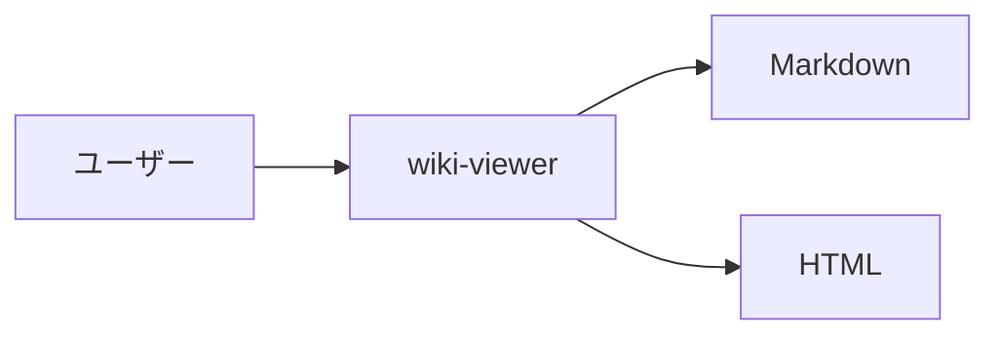

# wiki-viewer

GitHub Wiki 形式の Markdown ファイルを、ワンバイナリで手軽に閲覧できる Web アプリです。


## 特徴

- **ワンバイナリ** — 外部依存なし。ビルドして置くだけ
- **GitHub Wiki 互換** — `Home.md`, `_Sidebar.md`, `_Footer.md`, `[[Wiki Links]]` に対応
- **マルチ Wiki 対応** — サブディレクトリごとに独立した Wiki として自動認識
- **Mermaid 図** — ```mermaid コードブロックをそのまま描画
- **GFM 対応** — テーブル、タスクリスト、取り消し線など GitHub Flavored Markdown をフルサポート
- **レスポンシブ** — PC でもスマホでも読みやすいレイアウト

## インストール

```bash
go install github.com/tomohiro-owada/wiki-viewer@latest
```

または:

```bash
git clone https://github.com/tomohiro-owada/wiki-viewer.git
cd wiki-viewer
go build -o wiki-viewer .
```

## 使い方

### シングル Wiki モード

Markdown ファイルがあるディレクトリを直接指定:

```bash
wiki-viewer -dir ./my-wiki -port 8080
```

```
my-wiki/
├── Home.md            # トップページ
├── Getting-Started.md
├── Architecture.md
├── _Sidebar.md        # サイドバー (任意)
└── _Footer.md         # フッター (任意)
```

### マルチ Wiki モード

サブディレクトリに複数の Wiki がある場合、親ディレクトリを指定するだけ:

```bash
wiki-viewer -dir ./wikis -port 8080
```

```
wikis/
├── project-alpha/
│   ├── Home.md
│   ├── Setup-Guide.md
│   └── _Sidebar.md
└── project-beta/
    ├── Home.md
    └── API-Reference.md
```

`/` にアクセスすると Wiki 一覧が表示され、各 Wiki に遷移できます。

### コマンドラインオプション

| オプション | デフォルト | 説明 |
|-----------|-----------|------|
| `-dir` | `.` (カレントディレクトリ) | Wiki ファイルのディレクトリ |
| `-port` | `8080` | HTTP ポート番号 |

### モードの自動判定

- 指定ディレクトリ直下に `.md` ファイルがある → **シングル Wiki モード**
- `.md` ファイルがなくサブディレクトリに `.md` がある → **マルチ Wiki モード**

## GitHub Wiki 形式について

GitHub の Wiki で使われる規約に従っています:

- **ファイル名**: スペースの代わりにハイフン (`Getting-Started.md`)
- **Wiki リンク**: `[[Page Name]]` で他ページへリンク
- **パイプ記法**: `[[表示テキスト|Page Name]]` で表示名とリンク先を分離
- **サイドバー**: `_Sidebar.md` があれば左カラムに表示
- **フッター**: `_Footer.md` があればページ下部に表示
- **ホームページ**: `Home.md` がランディングページ

## Mermaid 図

コードブロックに `mermaid` を指定すると図として描画されます:

````markdown

````

## ライセンス

MIT
