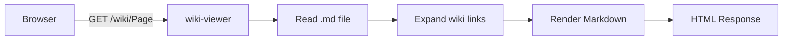

# Architecture

## Overview

wiki-viewer is a single Go binary that serves GitHub Wiki format markdown files.

| Component | Role |
|-----------|------|
| `main.go` | HTTP server and routing |
| `wiki.go` | Markdown loading and wiki-link expansion |
| `templates.go` | Embedded HTML template with CSS |

## How it works

1. Reads `.md` files from the specified directory
2. Expands `[[Wiki Links]]` to HTML anchors
3. Renders markdown to HTML via goldmark (GFM)
4. Serves with embedded CSS, no external dependencies

## Request Flow

Back to [[Home]].
